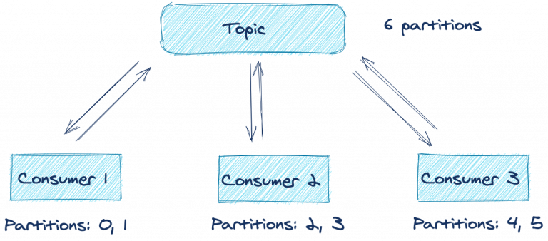

# 5 Development tips

## Acks
KafkaProducer обеспечивает надежность данных с помощью параметра конфигурации acks. Параметр acks указывает, сколько подтверждений должен получить продюсер, чтобы запись считалась доставленной брокеру. Варианты значений:

none — продюсер считает записи успешно доставленными после их отправки на брокер. Никакого подтверждения он не ждет.

one— продюсер ждет от брокера лидера подтверждение того, что он занес запись в лог.

all— продюсер ждет подтверждения от брокера лидера и реплик.

У разных приложений разные требования, и здесь нужно найти компромисс: или это будет высокая пропускная способность, но с риском потери данных, или гарантия надежности в ущерб пропускной способности.
У разных приложений разные требования, и здесь нужно найти компромисс: или это будет высокая пропускная способность, но с риском потери данных, или гарантия надежности в ущерб пропускной способности.


Давайте подробнее рассмотрим сценарий acks=all. Если у записи для параметра acks установлено all в кластере с тремя брокерами Kafka, в идеальной ситуации Kafka содержит три реплики данных — по одной на лидере и двух фолловерах. Когда у логов в каждой из трех реплик одинаковое смещение записи, они считаются синхронизированными. Другими словами, синхронизированные реплики содержат одинаковый контент для данной партиции топика. 


> В идеале лидер отправляет подтверждение продюсеру, когда сам получит
подтверждение от обоих фолловеров.

Но у acks=all есть некоторые нюансы. Он не указывает, сколько реплик должно быть синхронизировано. Брокер лидер всегда синхронизирован сам с собой. В некоторых ситуациях два остальных брокера могут отставать из-за разрыва сети, нагрузки на запись и т. д. В итоге, когда продюсер успешно отправляет данные, нужное число подтверждений может поступить только от одного брокера! Если два фолловера не синхронизированы, продюсер все равно получает нужное число подтверждений, но только от лидера.


>Если фолловеры почему-то не могут получить данные от лидера, запрос
продюсера все равно выполняется успешно, ведь все «синхронизированные»
реплики подтвердили запись.

Если фолловеры почему-то не могут получить данные от лидера, запрос
продюсера все равно выполняется успешно, ведь все «синхронизированные»
реплики подтвердили запись.

Указывая acks=all, мы делаем ставку на надежность. Если реплики отстают, возможно, следует вызвать исключение для новых записей, пока реплики не догонят.

Если синхронизированная реплика всего одна, формально правила соблюдены, но наше намерение при этом не реализовано. При использовании параметра acks=all нам нужна гарантия. Успешной должна считаться отправка с большинством доступных синхронизированных брокеров.

Соответствующая конфигурация есть: min.insync.replicas. Конфигурация min.insync.replicasзадает число реплик, которые должны быть синхронизированы, чтобы можно было продолжить запись. Конфигурация min.insync.replicas задается на уровне брокера или топика, а не для продюсера. Дефолтное значение для min.insync.replicas — 1. Чтобы избежать сценария, описанного выше, в кластере с тремя брокерами лучше указать 2.


>Недостаточно реплик! Если мы настроили min.insync.replicas=2 и не получили подтверждение от нужного числа реплик, запрос не выполняется.

Если число синхронизированных реплик меньше настроенного, лидер не пытается добавить запись в свой лог. Он выдает исключение NotEnoughReplicasException или NotEnoughReplicasAfterAppendException, и продюсер снова пытается записать данные. Если реплики не синхронизированы с лидером, можно повторить попытку, что продюсер и будет делать, пока не истечет настроенный delivery.timeout.ms.

Если правильно настроить min.insync.replicas и acks для продюсера, мы повысим надежность данных.

## Новый sticky partitioner в API продюсера

Kafka использует партиции, чтобы повысить пропускную способность и распределить нагрузку по всем брокерам в кластере. Записи в Kafka хранятся в виде пары ключ-значение, где ключ может быть null. Продюсеры Kafka отправляют записи не сразу. Сначала они группируют их в батчи для конкретных партиций. Пакеты позволяют эффективнее использовать сетевые ресурсы. Partitioner выбирает партицию для записей тремя способами.
Партиция может быть явно указана в объекте ProducerRecord через перегруженный конструктор ProducerRecord. В этом случае продюсер всегда использует эту партицию.
Если партиция не указана, а у ProducerRecord есть ключ, продюсер делит хэш ключа на количество партиций. Получившееся число и будет партицией, которую использует продюсер.
Если в ProducerRecord нет ключа и партиций, раньше в Kafka использовалось распределение по кругу (round-robin). Первую запись в пакете продюсер назначал партиции 0, вторую — партиции 1 и так далее, пока партиции не кончатся. Затем продюсер снова начинал с партиции 0 и повторял этот процесс для оставшихся записей.


>Батчи распределяются по партициям. При старом добром подходе round robin продюсер идет по партициям по возрастанию до максимального номера в топике, а потом опять начинает с нуля.

Такой метод хорошо подходит для равномерного распределения записей по партициям. Но есть недостаток: в итоге мы отправляем много не до конца заполненных пакетов. Эффективнее будет отправлять меньше пакетов, но с большим числом записей. Чем меньше пакетов, тем короче очередь запросов и меньше нагрузка на брокеры.

Давайте рассмотрим упрощенный пример. Возьмем топик с тремя партициями. Для простоты предположим, что приложение создало девять записей без ключа, и все они поступают одновременно.


>Порядок назначения партиций: после партиции 2 продюсер переходит к партиции 0.
Одновременно создается девять записей.
Продюсер распределяет записи по партициям методом round robin. В итоге на брокер отправляется три батча.

Итак, мы получили три пакета по три записи в каждом. Но будет лучше отправить один пакет с девятью записями — чем меньше пакетов, тем меньше трафика и нагрузки на брокеры.

В Apache Kafka 2.4.0 представлен sticky partitioner, с которым это стало возможным. Sticky partitioner не использует round robin а просто наполняет пакет для одной партиции, отправляет пакет, берет другую партицию и собирает пакет для нее. Давайте рассмотрим тот же пример, что и выше, но со sticky partitioner:


>Если мы используем sticky partitioner, первый батч отправляется в партицию 0. Второй — в партицию 1. Третий — в партицию 2, а потом опять с нуля.

Если мы наполняем пакет только для одной партиции, мы сокращаем число запросов, а значит и нагрузку на очередь запросов и задержку во всей системе. При этом распределение записей остается равномерным, поскольку partitioner отправляет полные пакеты в партиции по очереди. Этот подход тоже можно назвать круговым, только распределение идет не запросами, а целыми пакетами.

### Перейдем к изменениям для консюмера.

## Кооперативная ребалансировка групп консюмеров без stop-the-world
Kafka — это распределенная система, которая должна не только быть готовой к сбоям, но и успешно справляться с ними. Отличный пример того, как Kafka решает вопрос ожидаемого сбоя, — протокол группы консюмеров, который управляет несколькими инстансами консюмера для одного логического приложения. Если один инстанс консюмера останавливается, намеренно или случайно, Kafka выполняет ребалансировку, перекидывая работу на другой инстанс.

В Kafka 2.4 представлен новый протокол ребалансировки — кооперативная. Прежде чем поговорить о нем, давайте вспомним основные принципы групп консюмеров.

Предположим, у нас есть распределенное приложение с несколькими консюмерами, подписанными на один топик. Консюмеры с одинаковым group.id образуют группу консюмеров. Каждый консюмер в группе принимает сообщения от одной или нескольких партиций в топике. Партиции назначаются лидером группы консюмеров.



Как видите, в оптимальных условиях каждый из трех консюмеров обрабатывает записи от своих двух партиций. Что будет, если в приложении возникнет ошибка или связь с сетью прервется? Обработка партиций в этом топике будет прекращена, пока вы не восстановите приложение? К счастью, нет — благодаря протоколу ребалансировки.


Как видите, консюмер 2 по какой-то причине молчит или превысил лимит ожидания. Координатор группы удаляет его из группы и запускает ребалансировку. Этот механизм пытается равномерно распределить (сбалансировать) рабочую нагрузку по доступным членам группы консюмеров. В этом случае, поскольку консюмер 2 выбыл, ребалансировка назначает принадлежавшие ему партиции другим активным членам группы. Как видите, если один консюмер в группе потерян, обработка его партиций в топике не прекращается.

Но у дефолтного механизма ребалансировки есть недостаток. Каждый консюмер лишается назначенных партиций и ничего не обрабатывает, пока их не назначат обратно, поэтому иногда такую ребалансировку называют stop-the-world. Более того, в зависимости от используемого инстанса ConsumerPartitionAssignor, консюмеры просто переназначаются тем же партициям, с которыми работали до этого, поэтому пауза не имеет никакого смысла.

Такая реализация протокола ребалансировки называется eager rebalancing. Ее цель — гарантировать, что консюмеры в одной группе не будут назначены одинаковым партициям. Если одна партиция будет принадлежать двум консюмерам из одной группы, это приведет к непредсказуемому поведению.

Этого нельзя допустить. Но оказывается, есть более эффективный подход, который обеспечивает безопасность без пауз — пошаговая кооперативная ребалансировка (incremental cooperative rebalancing). Впервые представленный в Kafka Connect в Apache Kafka 2.3, этот подход теперь реализован и для протокола группы консюмеров. При таком подходе консюмеры не отказываются от партиций автоматически в начале ребалансировки. Вместо этого все члены кодируют свои назначения и отправляют эту информацию лидеру группы. Лидер группы решает, какие партиции должны сменить назначения, вместо того чтобы переназначать все с нуля.

Запускается вторая ребалансировка, которая затрагивает только те партиции, которым нужно изменить назначение, например, партиции без назначения или новые партиции. Если ничего не меняется, обработка не останавливается.

Если останавливать не все, а только нужные партиции, ребалансировка выходит менее затратной и отнимает меньше времени. Даже долгая ребалансировка воспринимается не так болезненно, потому что обработка продолжается. Это изменение стало возможным благодаря использованию CooperativeStickyAssignor. Пусть CooperativeStickyAssignor и выполняет вторую ребалансировку, зато позволяет быстрее вернуться к нормальной работе.

Чтобы использовать новый протокол ребалансировки, настройте для partition.assignment.strategy новый CooperativeStickyAssignor. **`Это изменение происходит на стороне клиента.`** Чтобы воспользоваться новым протоколом ребалансировки, достаточно обновить версию клиента. Если вы используете Kafka Streams, вам повезло еще больше. В Kafka Streams кооперативный протокол включен по умолчанию, так что вам ничего не придется делать.

## Инструменты командной строки

Установка Apache Kafka включает несколько инструментов в каталоге bin. Давайте рассмотрим четыре самых полезных из них. Это console-consumer, console-producer, dump-log и delete-records.

#### Kafka console producer
С console-producer можно создавать записи в топике прямо из командной строки. Это очень удобный способ быстро протестировать новые приложения-консюмеры, пока в топики еще не передаются данные. Запускаем console-producer:
```
kafka-console-producer --topic  \
                        --broker-list <broker-host:port> 
```
После выполнения команды открывается пустая строка. Вводим любые символы и нажимаем Enter, чтобы создать сообщение.

При этом мы отправляем только значения, без ключей. К счастью, есть способ отправить и ключи — нужно просто добавить в команду флаги:
```
kafka-console-producer --topic  \
                       --broker-list <broker-host:port> \
                       --property parse.key=true \
                       --property key.separator=":"
```

Свойство key.separator можно выбрать произвольно. Подойдет любой символ. Теперь можно отправлять полноценные пары ключ-значение прямо из командной строки. Если вы используете Confluent Schema Registry, вам доступны CLI продюсеры для отправки записей в схемы Avro, Protobuf и JSON.

#### Kafka console consumer
С console-consumer можно читать записи в топике прямо из командной строки. Возможность быстро запускать консюмер очень поможет при прототипировании и отладке. Допустим, мы создаем новый микросервис. Чтобы быстро проверить, что продюсер отправляет сообщения, выполняем команду:
```
kafka-console-consumer --topic  \
                          --bootstrap-server <broker-host:port>
```

Сразу отображаются записи (если продюсер отправляет данные в топик). Если нужно просмотреть все записи в топике с самого начала, добавляем в команду флаг --from-beginning.
```
kafka-console-consumer --topic <topic-name> \
                          --bootstrap-server <broker-host:port> \
                          --from-beginning
```

Если вы используете Schema Registry, вам доступны CLI консюмеры для схем Avro, Protobuf и JSON. Консюмеры в командной строке для Schema Registry работают с записями в формате Avro, Protobuf и JSON, а обычные консюмеры работают с записями примитивных типов Java: String, Long, Double, Integer и т. д. По умолчанию обычный консюмер ожидает ключи и значения типа String.

Если они принадлежат другому типу, предоставим десериализаторы с помощью флагов --key-deserializer и --value-deserializer с полным именем (FQN) класса соответствующих десериализаторов.

Наверное, вы заметили, что по умолчанию консольный консюмер выводит только значения сообщений. Если мы хотим посмотреть ключи, добавляем флаги:
```
kafka-console-consumer --topic  \
                          --bootstrap-server <broker-host:port> \
  --property print.key=true
  --property key.separator=":"
```
Как и для продюсера, значение разделителя ключей выбирается произвольно.

#### Dump log
Иногда при работе с Kafka хочется вручную проверить логи топика — из любопытства или для отладки какой-то проблемы. В этом нам поможет команда kafka-dump-log. Допустим, мы хотим посмотреть лог примера топика с говорящим именем example:
```
kafka-dump-log \
  --print-data-log \ 
  --files  ./var/lib/kafka/data/example-0/00000000000000000000.log 
```
- Флаг --print-data-log велит вывести данные в лог.
- Флаг --files является обязательным. Это может быть список файлов, разделенный запятыми.
Чтобы увидеть полный список опций и их описания, выполним команду kafka-dump-log с флагом --help.

Лог выглядит примерно так:
```
Dumping ./var/lib/kafka/data/example-0/00000000000000000000.log
Starting offset: 0
baseOffset: 0 lastOffset: 0 count: 1 baseSequence: -1 lastSequence: -1 producerId: -1 producerEpoch: -1 partitionLeaderEpoch: 0 isTransactional: false isControl: false position: 0 CreateTime: 1599775774460 size: 81 magic: 2 compresscodec: NONE crc: 3162584294 isvalid: true
| offset: 0 CreateTime: 1599775774460 keysize: 3 valuesize: 10 sequence: -1 headerKeys: [] key: 887 payload: -2.1510235
baseOffset: 1 lastOffset: 9 count: 9 baseSequence: -1 lastSequence: -1 producerId: -1 producerEpoch: -1 partitionLeaderEpoch: 0 isTransactional: false isControl: false position: 81 CreateTime: 1599775774468 size: 252 magic: 2 compresscodec: NONE crc: 2796351311 isvalid: true
| offset: 1 CreateTime: 1599775774463 keysize: 1 valuesize: 9 sequence: -1 headerKeys: [] key: 5 payload: 33.440664
| offset: 2 CreateTime: 1599775774463 keysize: 8 valuesize: 9 sequence: -1 headerKeys: [] key: 60024247 payload: 9.1408728
| offset: 3 CreateTime: 1599775774463 keysize: 1 valuesize: 9 sequence: -1 headerKeys: [] key: 1 payload: 45.348946
| offset: 4 CreateTime: 1599775774464 keysize: 6 valuesize: 10 sequence: -1 headerKeys: [] key: 241795 payload: -63.786373
| offset: 5 CreateTime: 1599775774465 keysize: 8 valuesize: 9 sequence: -1 headerKeys: [] key: 53596698 payload: 69.431393
| offset: 6 CreateTime: 1599775774465 keysize: 8 valuesize: 9 sequence: -1 headerKeys: [] key: 33219463 payload: 88.307875
| offset: 7 CreateTime: 1599775774466 keysize: 1 valuesize: 9 sequence: -1 headerKeys: [] key: 0 payload: 39.940350
| offset: 8 CreateTime: 1599775774467 keysize: 5 valuesize: 9 sequence: -1 headerKeys: [] key: 78496 payload: 74.180098
| offset: 9 CreateTime: 1599775774468 keysize: 8 valuesize: 9 sequence: -1 headerKeys: [] key: 89866187 payload: 79.459314
```

Команда dump-log дает много полезной информации, например key, payload, смещение и метка времени для каждой записи. Это данные для демо-топика, где всего 10 сообщений. Для реального топика данных будет гораздо больше. В этом примере ключи и значения топика — это строки. Чтобы использовать dump-log с ключами и значениями других типов, используем флаги --key-decoder-class и --value-decoder-class.

#### Delete records
Kafka хранит записи для топиков на диске и сохраняет их даже после прочтения консюмерами. Записи не хранятся в одном большом файле. Они разделены на сегменты по партициям, причем порядок смещений будет непрерывным в сегментах одной партиции. Поскольку серверы не резиновые, Kafka позволяет контролировать время хранения и объем данных:
- Параметр log.retention.hours задает время хранения данных. По умолчанию это 168 часов (одна неделя).
- Параметр log.retention.bytes задает размер сегментов, которые можно удалять.

Однако дефолтное значение log.retention.bytes составляет -1, то есть размер сегмента не ограничен. Если мы не настроим размер сегмента и период хранения, место на диске скоро закончится. Мы не хотим удалять файлы вручную. Нам нужен контролируемый рабочий способ удалять записи из топика, чтобы освободить место. К счастью, в Kafka для этого есть специальный инструмент.

У kafka-delete-records два обязательных параметра:
- --bootstrap-server — брокеры для начальной загрузки;
- --offset-json-file — файл JSON с параметрами удаления.

Пример файла JSON:
```
{
   "partitions": [
                  {"topic": "example", "partition": 0, "offset": -1}
                 ],
                 "version":1
 }
```

Как видите, у JSON простой формат. Это массив объектов JSON. У каждого объекта JSON три свойства:

- topic — топик, из которого удаляем данные;
- partition — партиция, из которой удаляем данные;
- offset — смещение, с которого начинаем удалять данные, двигаясь от большего к меньшему.

В этом примере возьмем топик из раздела про dump-log, чтобы получить простейший файл JSON. Если партиций или топиков больше, файл конфигурации JSON будет больше.

Как выбрать offset в файле JSON? У нас в примере всего 10 записей, так что начальное смещение рассчитать легко. На практике это будет не так очевидно. Помните, что смещение не эквивалентно номеру сообщения, так что мы не может просто удалить все, начиная с сообщения 42. Если указано -1, используется смещение high watermark, то есть мы удаляем все данные из топика. high watermark — это максимальное доступное смещение для чтения (смещение последнего успешно реплицированного сообщения плюс один).

Чтобы выполнить эту команду, вводим в командной строке:
```
kafka-delete-records --bootstrap-server <broker-host:port> \
                     --offset-json-file offsets.json
```

После выполнения команды в консоли отображается примерно следующее:
```
Executing records delete operation
Records delete operation completed:
partition: example-0  low_watermark: 10
```

Результаты команды показывают, что Kafka удалила все записи из партиции топика example-0. Значение low_watermark, равное 10, указывает минимальное смещение, доступное консюмерам. Раз в example topic всего 10 записей, смещения имеют номера от 0 до 9, то есть консюмеры больше не смогут читать эти записи. Больше о реализации удаления: KIP-107 и KIP-204.

## Заголовки записей

В Apache Kafka 0.11 представлены заголовки записей. Заголовки записей позволяют добавлять метаданные о записи Kafka, но при этом не указывать дополнительную информацию в парах ключ-значение самой записи. Допустим, мы хотим добавить в сообщение идентификатор системы, из которой поступили данные. Это может понадобиться для отслеживания происхождения, аудита или упрощения маршрутизации данных.

Почему бы не указать эту информацию в ключе, чтобы потом просто извлечь нужную часть и отправить данные куда надо? Добавление искусственных данных в ключ может привести к двум проблемам.

- Во-первых, если вы используете compacted топик, при добавлении данных в ключ запись будет выглядеть уникальной, хотя это не так. В итоге compaction будет работать не так, как хотелось бы.
- Во-вторых, представьте, что будет, если идентификатор системы будет доминировать в отправленной записи. Это может привести к серьезному перекосу ключей. В зависимости от способа чтения данных из партиций, неравномерное распределение ключей может увеличить задержку при обработке.

В таких ситуациях на выручку придут заголовки. Исходный KIP, где были предложены заголовки, предусматривал дополнительные варианты использования:
- Автоматизация маршрутизации сообщений между кластерами на основе заголовков.
- Корпоративные инструменты APM (например, Appdynamics или Dynatrace) должны использовать идентификаторы транзакций, чтобы мониторить весь поток транзакций.
- Вместе с сообщением записываются метаданные для аудита, например идентификатор клиента, который создал запись.
- Содержание сообщения должно быть защищено сквозным шифрованием и надежно подписано, но компонентам экосистемы требуется доступ к метаданным для выполнения задач.

Итак, мы определились с назначением заголовков, а теперь посмотрим, как добавлять заголовки в записи Kafka.
#### Добавление заголовков в записи Kafka
Код Java для добавления заголовков в ProducerRecord:
```
ProducerRecord<String, String> producerRecord = new ProducerRecord<>("bizops", "value"); 

producerRecord.headers().add("client-id", "2334".getBytes(StandardCharsets.UTF_8)); 
producerRecord.headers().add("data-file", "incoming-data.txt".getBytes(StandardCharsets.UTF_8)); 

// Details left out for clarity
producer.send(producerRecord);
```
- Создаем инстанс класса ProducerRecord.
- Вызываем метод ProducerRecord.headers() и добавляем ключ и значение для заголовка.
- Добавляем еще заголовок.

На что нужно обратить внимание? Интерфейс header ожидает ключ String и значение в виде байтового массива. Для одного ключа можно добавить сколько угодно заголовков. Дублирующиеся ключи не перезаписывают предыдущие данные с тем же ключом.

Существуют перегруженные конструкторы ProducerRecord, которые принимают Iterable<Header>. Можно создать собственный конкретный класс, который реализует интерфейс Header и передает коллекцию, реализующую интерфейс Iterable. Но на практике будет достаточно простого метода, который мы показали здесь.

Добавлять заголовки мы теперь умеем, давайте узнаем, как получить к ним доступ со стороны консюмера.

#### Извлечение заголовков

Получаем доступ к заголовкам при чтении записей:
```
//Details left out for clarity

ConsumerRecords<String, String> consumerRecords = consumer.poll(Duration.ofSeconds(1));

for (ConsumerRecord<String, String> consumerRecord : consumerRecords) { 
    for (Header header : consumerRecord.headers()) {  
        System.out.println("header key " + header.key() + "header value " + new String(header.value())); 
    }
}
```
- Проходим по ConsumerRecords.
- Для каждой ConsumerRecord проходим по заголовкам.
- Обрабатываем заголовки.

Из кода видно, что для обработки заголовков мы используем метод ConsumerRecord.headers(), который их возвращает. В примере выше мы выводим заголовки на консоль в целях демонстрации. Получив доступ к заголовкам, мы обрабатываем их в зависимости от потребностей. Для чтения заголовков из командной строки KIP-431 добавляет поддержку вывода заголовков из ConsoleConsumer. Эта фича будет доступна в релизе Apache Kafka 2.7.0.

Еще можно просмотреть заголовки из командной строки с помощью kafkacat. Пример команды:
```
kafkacat -b kafka-broker:9092 -t my_topic_name -C \
  -f '\nKey (%K bytes): %k
  Value (%S bytes): %s
  Timestamp: %T
  Partition: %p
  Offset: %o
  Headers: %h\n'
```

[//]: # (https://m.habr.com/ru/company/southbridge/blog/547264/ https://www.confluent.io/blog/5-things-every-kafka-developer-should-know/)