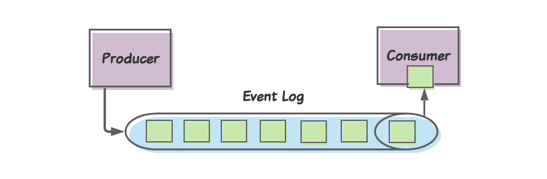
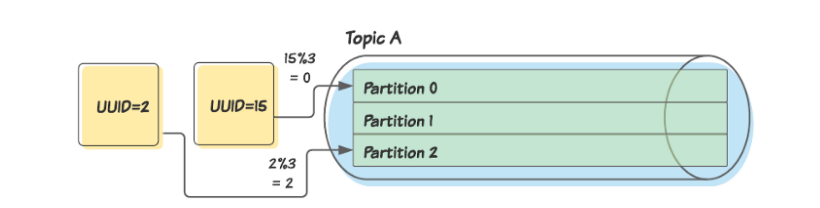
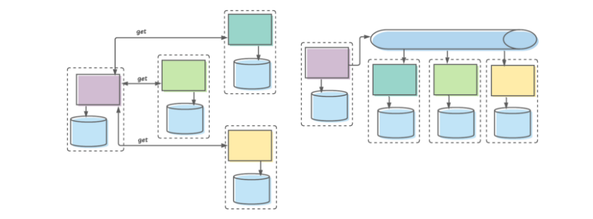
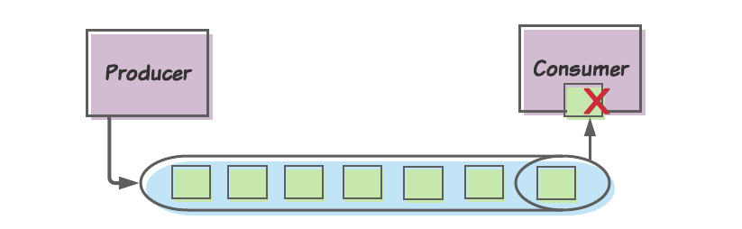
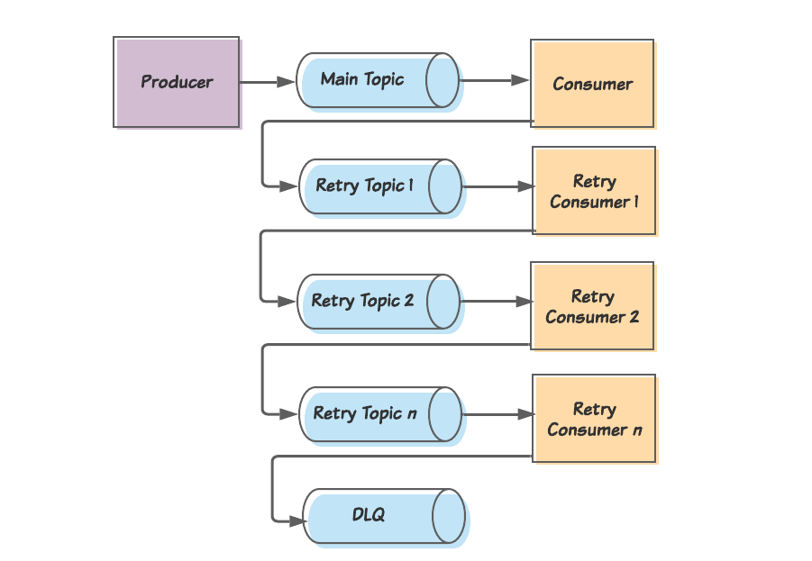
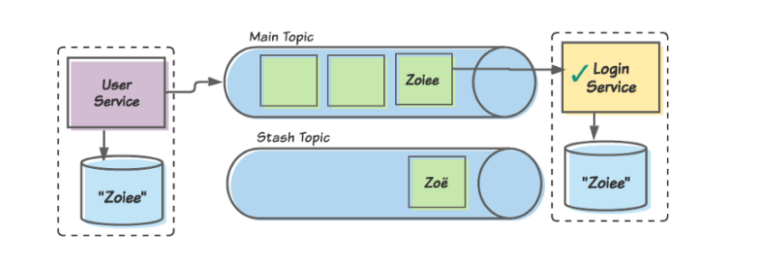
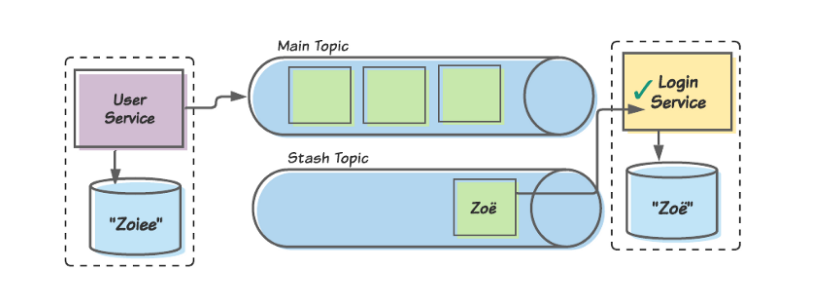

Apache Kafka стала ведущей платформой для асинхронной коммуникации между микросервисами. В ней есть мощные функции, которые позволяют строить устойчивые к ошибкам и отказам асинхронные архитектуры.

В то же время нужно предвидеть потенциальные ловушки. Неспособность заранее распознать проблемы, которые могут (нет, будут) возникать, приведет к тому, что у нас будут уязвимые к ошибкам и искажению данных системы.

Первое и самое важное, мы должны понимать, что потребление сообщений может и будет неудачным. Второе, нам нужно проследить, что мы правильно реагируем на эти неудачи, чтобы не вызвать еще больше проблем в будущем.

Мы кратко остановимся на важных для нашего обсуждения понятиях.

## Журнал событий, продюсеры и консюмеры

Kafka — система для обработки потоков информации. Концептуально мы понимаем Kafka как общность трех базовых компонентов:

Журнал событий (event log), в который публикуются сообщения.
Продюсеры (producers, publishers), публикуют сообщения в журнал событий.
Консюмеры (consumers), потребляют сообщения из журнала событий.



В отличие от традиционных очередей сообщений, как в RabbitMQ, в Kafka именно консюмеры определяют, когда прочитать сообщение (т.е. Kafka использует скорее pull, нежели push модель). У каждого сообщения есть **смещение (offset)**, и каждый консюмер отслеживает (или фиксирует) смещение последнего потребленного сообщения. Это позволяет консюмерам затем запрашивать следующее сообщение через смещение этого сообщения.

### Топики

Журнал событий разделен на топики (topics), каждый из которых определяет один тип сообщений, которые в него публикуются. И хотя от нас, инженеров, зависит определение топиков, нам стоит помнить некоторые простые и надежные правила:

 - Каждый топик описывает событие, о котором должны знать другие сервисы.
 - Каждый топик должен определять единую схему, которой должно соответствовать каждое сообщение.

### Партиции и ключи партиций

Топики далее разделяются на **партиции (partitions)**. Партиции дают возможность потреблять сообщения параллельно. Kafka позволяет детерминированно назначать сообщения в партиции при помощи **ключа партиции (partition key)**. Ключ партиции — это часть данных (обычно некоторый атрибут самого сообщения, например, идентификатор), к которой применяется алгоритм для определения партиции.



Здесь мы назначаем ключом партиции поле UUID сообщений. Продюсер применяет алгоритм (например, модифицирует каждое значение UUID по количеству партиций), чтобы отнести каждое сообщение к какой-то партиции.

Использование ключей партиций таким образом позволяет нам удостовериться в том, что каждое сообщение, сопоставляемое с определенным идентификатором, публикуется в одной партиции.

Также стоит отметить, что несколько консюмеров могут быть объединены в одну группу консьюмеров. Kafka обеспечит прочтение любого сообщения в данной партиции одним и тем же количеством консюмеров в рамках группы.

## Использование Kafka с микросервисами

Kafka достаточно мощна. В этой связи она используется в различных средах, охватывая множество вариантов применения.

### Передача сообщения через ограниченный контекст

Когда мы только начали создавать микросервисы, многие из нас сразу приняли централизованную модель. У каждого фрагмента данных был единственный микросервис (т.е. единственный источник истины), в котором этот фрагмент находился. Если какому-то другому микросервису был нужен доступ к этим данным, он делал синхронный вызов для их получения.

Этот подход привел к ряду проблем, включая длинные синхронные цепочки вызовов, единые точки отказа, снижение автономии команды и т.д.

В итоге мы узнали лучший способ. В современных зрелых архитектурах мы разбиваем коммуникацию на обработку команд и обработку событий.

Обработка команд обычно выполняется в одном ограниченном контексте (bounded context) и по-прежнему обычно включает синхронную коммуникацию.

События же обычно генерируются службами в одном ограниченном контексте и асинхронно публикуются в Kafka для потребления службами в других ограниченных контекстах.



> На схеме слева представлено то, как мы раньше проектировали связь между микросервисами: сервис в рамках одного ограниченного контекста (представлен прямоугольником с пунктирной линией) получает синхронные вызовы от сервисов в рамках других ограниченных контекстов. Справа представлено то, как мы делаем это сейчас: сервис в рамках одного ограниченного контекста публикует события, сервисы из других ограниченных контекстов потребляют эти события в своем темпе.

Назовем этот вариант трансграничной публикацией событий (cross-boundary event publishing).

Производя трансграничную публикацию событий, мы должны публиковать агрегаты (aggregates). Агрегаты — это независимые группы сущностей, каждая из которых рассматриваются как единичные атомарные сущности. У каждого агрегата есть «корневой» объект, а также некоторое количество подчиненных объектов, которые предоставляют дополнительные данные.

В нашем примере мы можем определить агрегат UserAccount. Его корневым объектом будет, вероятно, сущность User (содержащая в глобальном масштабе уникальный ID: имя, фамилия, дата рождения и т.д.). Там также могут содержаться сущности, представляющие фрагменты контактной информации (EmailAddress, PhoneNumber и т.д.). Что важно, агрегат примет уникальный в глобальном масштабе ID как свой собственный ID.

Когда наш UserAccount публикует сообщение, информационное наполнение этого сообщения будет некоей репрезентацией (JSON или Avro, например) агрегата UserAccount. Важно, что сервис определит уникальный ID учетной записи пользователя как ключ партиции. Это обеспечит в будущем публикацию изменений в любых сущностях любого UserAccount в одну и ту же партицию.

### Что происходит, когда возникает проблема?

Хотя трансграничная публикация событий с помощью Kafka оказывается достаточно элегантной, это распределенная система. Поэтому многое может пойти не так. Мы рассмотрим, наверное, самую типичную, мучительную проблему: консюмер не может обработать потребленное сообщение.



И что теперь делать?

### Идентифицировать это как проблему

Первое, что команды делают не так, это просто не распознают это как потенциальную проблему. Время от времени будет случаться сбой сообщений, и нам придется разработать стратегию решения этой проблемы… до того, как она по-настоящему случится.

### Разве нельзя просто повторно это сообщение передать (retry)?

По умолчанию, если консюмер не производит успешного потребления сообщения (т.е. консюмер не может произвести текущее смещение), он будет снова и снова возвращаться к этому сообщению. Почему же мы не можем позволить этой модели по умолчанию работать и возвращаться к сообщению, пока не будет успеха?

Проблема в том, что успешной обработки может не произойти никогда. По крайней мере без какого бы то ни было ручного вмешательства. Консюмер поэтому никогда не перейдет к последующим сообщениям, и обработка сообщений зайдет в тупик.

### Хорошо, а нельзя ли просто пропустить сообщение?

Мы обычно позволяем синхронным запросам не заканчиваться успехом. Например, ПУБЛИКАЦИЯ “создать пользователя”, созданная в нашем UserAccount, может содержать неверные или неполные данные. В этом случае мы просто можем выдать код ошибки (например, HTTP 400) и попросить вызывающего оператора попытаться еще раз.

И хотя это не идеальный выход, он не приведет ни к каким продолжительным проблемам в целостности наших данных. Эта ПУБЛИКАЦИЯ представляет команду, что-то, что еще не произошло. Даже если мы позволим этой публикации завершиться без успеха, наши данные останутся в согласованном состоянии.

Это не тот случай, когда мы отбрасываем сообщения. Сообщения представляют собой события, которые уже произошли. Любой консюмер, игнорирующий события, будет перманентно не согласован с вышестоящим сервисом, который сформулировал событие.

И все это ради того, чтобы сказать, мы не хотим пропускать сообщения.

### И как же нам решить проблему?

Это не самая легкая для нас проблема. Поэтому когда мы осознали необходимость ее решить, нам, возможно, придется посмотреть в интернете, как же ее решить. Что приводит ко второй проблеме: там можно найти советы, которым лучше не следовать.

### Retry topic: популярное ходовое решение

Одно из популярных решений, которое вы найдете на просторах интернета, включает в себя топик повтора (retry topic). Мелкие детали разнятся от реализации к реализации, но общая канва такова:

 - Консюмер делает попытку потребить сообщение из главного топика.
 - Если первая попытка не удалась, консюмер публикует сообщение в топик повтора и затем фиксирует смещение сообщения, чтобы иметь возможность продолжить работу со следующим сообщением.
 - На топик повтора подписан консюмер повтора, у которого та же самая логика, что и у основного консюмера. Этот консюмер вводит короткую отсрочку между попытками потребить сообщение. И если этот консюмер также не может удачно потребить сообщение, он публикует сообщение во второй топик повтора и фиксирует смещение сообщения.
 - Так это продолжается с еще некоторым количеством повторных топиков и консюмеров, в каждом случае с увеличивающейся отсрочкой (что служит стратегией отката (backoff strategy)). В конце концов, когда сообщение не удается обработать последнему консюмеру повтора, оно отправляется в очередь отвергаемых сообщений (dead letter queue, DLQ), где его вручную сортируют инженеры.



> Концептуально шаблон retry-topic (топик повтора) определяет количество топиков, на которые переведут необработанные сообщения. Если консюмер главного топика потребляет сообщение, которое он не может обработать, он опубликует это сообщение в топике повтора 1 и совершает текущее смещение, чтобы освободиться для следующих сообщений. Консюмер из топика повтора будет клоном основного консюмера, с тем лишь отличием, что он в случае неудачи будет публиковать сообщение в новый топик повтора. В итоге, если последний консюмер не смог обработать сообщение, он опубликует сообщение в очередь отвергаемых сообщений (dead letter queue, DLQ)

### В чем же проблема?

На первый взгляд, этот подход кажется обоснованным. И в реальности он нормально сработает во многих случаях. Проблема в том, что это решение не подойдет в качестве универсального. На самом деле есть некоторые случаи, как наша трансграничная публикация событий, для которых этот подход будет опасным.

### Он не берет в расчет различия типов проблем

Первая проблема: он не берет в расчет, что в большинстве случаев будет встречаться одна из двух причин неудачного потребления событий: исправимая ошибка и неисправимая ошибка.

**Исправимые ошибки (recoverable errors)** — ошибки, которые в случае, если мы достаточно количество раз предпримем повтор, в итоге будут исправлены. Простым примером может стать консюмер, сохраняющий данные в базу. Если база данных будет временно недоступна, консюмер даст сбой, когда придет следующее сообщение. Как только база данных снова станет доступна, тогда консюмер снова сможет обрабатывать сообщение.

По-другому на это можно посмотреть следующим образом: исправима та ошибка, корневая причина которой является внешней по отношению к сообщению и консюмеру. Как только решается эта проблема, наш консюмер продолжит работу, как будто ничего не произошло. (И вот здесь как раз кроется частый источник путаницы. Термин «исправимый» не означает, что само приложение — в нашем случае консюмер — производит исправление. Как раз наоборот, именно какой-то внешний ресурс — в нашем случае база данных — дает сбой и в итоге исправляется.)

Штука в том, что исправимые ошибки поразят все без исключения сообщения в теме. Вспомним, что все сообщения в теме должны соответствовать одной схеме и представлять один тип данных. Аналогично и наш консюмер будет проводить то же самое действие(я) для каждого события в теме. Поэтому если сообщение А должно дать сбой из-за отказа базы данных, тогда то же самое сделают сообщение В, сообщение С и т.д.

**Неисправимые ошибки(non-recoverable errors)** — ошибки, которые все равно будут случаться, независимо от того, сколько раз мы попробуем повторно выполнить операцию. Например, пропуск поля в сообщении может привести к NullPointerException. Или из-за поля со специальным символом сообщение будет отображено как не поддающееся синтаксическому анализу.

В отличие от исправимых ошибок, неисправимые в основном затрагивают одиночные, изолированные сообщения. Например, если только в сообщении А содержится специальный символ, то сообщение В пройдет успешно, как и сообщение С и т.д.

Также, в отличие от исправимых ошибок, чтобы решить неисправимые ошибки, надо «исправить» сам консюмер (никогда не «исправляйте» сами сообщения: это неизменяемые записи!) Например, мы можем исправить наш консюмер, чтобы все значения NULLS обрабатывались должным образом, а затем снова его развернуть.

И какое все это имеет отношение к решению с топиками повторов?

Для начала, это не будет особо полезным при исправимых ошибках. Мы помним, что до разрешения внешней проблемы исправимая ошибка будет затрагивать каждое сообщение, не только текущее. Так что, конечно, направление сообщения со сбоем в топик повтора освободит путь для следующего сообщения. Но это сообщение также даст сбой, и следующее после него, и после него… Мы просто можем предоставить консюмеру возможность самому повторять операцию, пока проблема не разрешится.

А что насчет неисправимых ошибок? Очереди повтора могут помочь в этом случае. Если одно проблемное сообщение задерживает потребление всех последующих сообщений, то уборка его с пути определенно разблокирует нашего консюмера (конечно, наличие нескольких топиков повтора становится излишним).

Однако хотя очередь повторов может помочь разблокировать консюмеров, устранив сообщения с неисправимыми ошибками, она может привести к еще более серьезным проблемам. Давайте читать дальше, чтобы выяснить почему…

### Он игнорирует очередность

Кратко повторим некоторые важные аспекты трансграничной публикации событий. После обработки команды в нашем ограниченном контексте мы публикуем соответствующее событие в топик Kafka. Что важно, мы указываем ID агрегата в качестве ключа партиции.

Почему это важно? Это гарантирует, что изменения в любом отдельно взятом агрегате всегда публикуются в одну и ту же партицию.

Хорошо. Почему же тогда это важно? Публикация событий в одну и ту же партицию гарантирует их обработку в той последовательности, в которой они произошли. Если изменения в одном и том же агрегате произведены с небольшим интервалом, а возникающие в связи с ними события записаны в разные партиции, может возникнуть подобие гонки, в ходе которой консюмер потребляет второе изменение прежде первого. А это приводит к противоречивости данных.

Давайте рассмотрим небольшой пример. Наш ограниченный контекст User предлагает приложение, позволяющее пользователям менять свои имена. Пользователь А меняет свое имя с Zoey на Zoё… и затем сразу же меняет его на Zoiee. Если бы нам не была важна очередность, низовой консюмер (скажем, в ограниченном контексте Login) первым может обработать изменение на Zoiee, а сразу после этого переписать его на Zoё.

Теперь данные Login рассинхронизированы с данными User. Более того, каждый раз при входе на наш сайт Zoiee будет видеть приветствие: «Добро пожаловать, Zoё!»

И это настоящая проблема с retry topic. Они оставляют наши консюмеры уязвимыми к обработке событий не в порядке очередности. Если на консьюмера повлияет временный сбой базы данных, пока он обрабатывает изменение Zoё, он переправит сообщение в топик повтора, чтобы обработать его позднее. Если сбой в базе данных исправлен к тому времени, как появляется изменение Zoiee, тогда это сообщение будет успешно обработано первым, а позднее перезаписано изменением Zoё.

Для понятности пример с Zoiee/Zoё так прост. В реальности обработка событий в порядке очередности может привести к целому ряду проблем с искажением данных. Что хуже, эти проблемы сперва остаются незамеченными. Они обычно приводят к искажению данных, которое остается какое-то время никем не замеченным, но постепенно увеличивается. Часто к тому времени, когда мы понимаем, что произошло, большие фрагменты информации уже поражены.

### В каких же случаях retry topic может быть полезен?

Стоит прояснить, что это не всегда плохой вариант. Несомненно, есть случаи, когда топики повторов оптимально подходят. Если конкретно, этот шаблон применяем, когда задача консюмера — собирать неизменяемые записи. Такие примеры могут включать:

 - Консюмера, который обрабатывает потоки активности на веб-сайте для создания отчетов.
 - Консюмера, добавляющего транзакции в журнал (при условии, что эти транзакции не нужно отслеживать в определенном порядке.
 - Консюмера, который извлекает данные из других источников данных.

Эти и другие подобные консюмеры могут получить пользу от шаблона топика повторов без риска искажения данных.

### Все же небольшое предостережение

Даже в случае таких вариантов использования нам все равно следует действовать с осторожностью. Создание такого решения сложно и затратно. Поэтому как организация мы не хотим писать новое решение для каждого нового консюмера. Вместо этого мы захотим создать одно решение — библиотеку, контейнер и т.д. — которое можно использовать в разных сервисах.

И здесь кроется дополнительный повод для беспокойства. Мы можем создать решение с топиком повторов для релевантных консюмеров. К сожалению, через некоторое время это решение проникнет в консюмеры трансграничной публикации событий. Команды, которые занимаются теми консюмерами, могут не знать о рисках. И как мы обсуждали ранее, они просто не заметят проявления проблем, пока не произойдет существенного искажения данных.

Поэтому прежде чем мы внедрим решение с топиком повторов, мы должны быть на 100% уверены, что либо:
 - Наш бизнес таков, что у нас никогда не будет консюмеров, которые обновляют существующие данные, или
 - У нас есть незыблемые средства управления, чтобы не допустить внедрения решения с топиком повторов для таких консюмеров.

### Как мы можем исправить шаблон?

Учитывая, что шаблон с топиком повтора не может быть приемлемым решением для трансграничной публикации событий, можем ли мы его адаптировать так, чтобы это стало возможным?

Изначально я планировал, чтобы эта статья содержала решение, но в процессе я осознал, что нет единого решения на все случаи. Поэтому вместо первоначального плана мы обсудим некоторые вещи, которые стоит учитывать.

### Снятие неоднозначности типов ошибок

Наша жизнь будет гораздо проще, если мы сможем снимать неоднозначность между исправимыми и неисправимыми ошибками. Например, если наш консюмер начинает испытывать исправимые ошибки, то топики повторов становятся излишними.

Поэтому мы можем попытаться определить, с каким типом ошибки мы имеем дело:

```sh
void processMessage(KafkaMessage km) {
 try {
   Message m = km.getMessage();
   transformAndSave(m);
 } catch (Throwable t) {
   if (isRecoverable(t)) {
     // ...
   } else {
     // ...
   }
 }
}
```

В приведенном выше примере псевдо-кода на Java isRecoverable() будет использовать подход белого списка (whitelist approach) для определения, представляет ли t исправимую ошибку. Другими словами, он проверяет t, чтобы определить соответствует ли она любой другой известной исправимой ошибке (скажем, ошибке соединения SQL или таймаут клиента REsT), и возвращает true, если это так. Если нет, возвращает false. Это поможет предотвратить нескончаемую блокировку неисправимых ошибок.

Признаемся, что снимать неоднозначность между исправимыми и неисправимыми ошибками может быть непросто. Например, SQLException может показывать отказ базы данных (исправимый) или нарушение ограничения (неисправимое). При возникновении сомнений нам, наверное, стоит предположить, что ошибка неисправима, что повышает риск отправить хорошие сообщения в stash topic (назовем его топик-загашник), что отложит их обработку… Но в то же время мы избежим нечаянного забуксовывания, когда консюмер будет бесконечно пытаться обработать неисправимую ошибку.

### Повторная обработка исправимых ошибок консюмером

Как мы уже говорили, в случае с исправимыми ошибками мало смысла отправлять сообщение в топик повторов. Мы просто освободим очередь, чтобы дать место для провала следующему сообщению. Вместо этого консюмер просто может пытаться заново, пока состояние не исправится.

Конечно, наличие исправимой ошибки свидетельствует о наличии проблемы с внешним ресурсом.

Забивание этого ресурса запросами не улучшит ситуацию. Поэтому мы захотим применить стратегию отката для наших повторных попыток. Псевдо-Java код теперь выглядел бы как-то так:

```sh
void processMessage(KafkaMessage km) {
 try {
   Message m = km.getMessage();
   transformAndSave(m);
 } catch (Throwable t) {
   if (isRecoverable(t)) {
     doWithRetry(m, Backoff.EXPONENTIAL, this::transformAndSave);
   } else {
     // ...
   }
 }
}
```

(Заметьте, любой механизм отката должен быть настроен так, чтобы предупреждать нас, когда он достигает определенного предела, уведомляя нас о потенциально серьезной проблеме).

## Встречаясь с неисправимыми ошибками, отправляйте сообщения сразу в последний топик

С другой стороны, когда наш консюмер встречается с неисправимой ошибкой, нам, вероятно, хочется убрать это сообщение подальше, чтобы освободить последующие сообщения. Но поможет ли в этом случае множество топиков повторов? Не совсем. Просто наше сообщение не сможет быть обработано n раз, прежде чем отправиться в DLQ. Тогда почему бы сразу его туда не отправить?

Также как и с топиком повтора, у этого топика-загашника будет свой консюмер, идентичный основному консюмеру. Но так же как DLQ, этот консюмер не всегда будет потреблять сообщения. Он будет это делать только в случае явной в этом необходимости.

### Подумаем об очередности

Давайте посмотрим, где мы с вами находимся в плане очередности. Используем снова пример User/Login. Консюмер Login может получить ошибку, пытаясь обработать символ ё в имени Zoё. Распознав его как неисправимую ошибку, консюмер откладывает это сообщение в сторону и продолжает со следующими. Вскоре он дойдет до сообщения Zoiee и удачно его обработает.



Сообщение Zoё было отложено в загашник, а сообщение Zoiee удачно обработано. На некоторое время данные между двумя ограниченными контекстами единообразны.

Чуть позже наша команда исправляет консюмера, чтобы он мог правильно обрабатывать специальные символы, и заново его развертывает. После этого мы заново публикуем сообщение Zoё в консюмера, и теперь он безошибочно его обрабатывает.



Когда обновленный консюмер позднее обрабатывает отложенное сообщение Zoё, данные между двумя ограниченными контекстами не согласуются. Поэтому пока ограниченный контекст User думает о пользователе как о Zoiee, ограниченный контекст Login знает ее как Zoё.

Очевидно, у нас не получилось соблюсти очередность. Zoё была обработана консюмером Login после Zoiee, хотя должно было быть наоборот. Мы можем начать откладывать в загашник каждое сообщение после откладывания одного, но в таком случае мы быстро окажемся в тупике.

Однако если наш консюмер может отслеживать ID сообщений, которые он отложил, он может также откладывать все сообщения с тем же самым ID. Другими словами, нам не надо соблюдать очередность всех сообщений… А только сообщений с единственным агрегатом.

Как только мы получили уведомление об отложенных в загашнике сообщениях, мы можем отменить развертывание нашего консюмера и исправить его код (важно: никогда не изменяйте само сообщение, сообщения представляют собой неизменяемые события!). После исправления и тестирования консюмера мы можем заново ввести его в эксплуатацию. Конечно, перед возобновлением потребления основного топика нам надо будет с особым внимание отнестись к обработке всех отложенных сообщений из топика-загашника. Таким образом мы продолжим поддерживать очередность. По этой причине мы сначала запустим консюмера загашника, и только после того как он завершит (имеем в виду все единицы в группе консюмеров, если мы используем несколько консюмеров), мы отменим его развертывание и развернем основного консюмера.

Мы также должны понимать, что пока наш исправленный консюмер обрабатывает отложенные сообщения, он может столкнуться с дополнительными ошибками. В этом случае его стратегия по решению ошибок будет такой, как мы уже обсуждали:

 - если ошибка исправимая, он повторит с откатами;
 - если ошибка неисправимая, он отложит данное сообщение и продолжит со следующим.

Для этих целей, возможно, нам стоит подумать о создании второго топика-загашника.

### Согласны на некоторую несогласованность данных?

Создание такой системы может быть довольно сложной задачей. Ее сложно строить, тестировать и обслуживать. Поэтому некоторые организации могут решить определить вероятность появления несогласованных данных и решить, могут ли они жить с таким риском.

Во многих случая такие организации могут задействовать механизм сверки данных, чтобы их данные в итоге (и это достаточно длительное “в итоге”) становились согласованными. Для этого существует много стратегий, но все они лежат за пределами охвата этой статьи.

### Заключение

Если вам кажется, что работа с повторными попытками обработки сложна, вам не кажется. Это так и есть. Особенно если сравнивать ее с относительной элегантностью Kafka, когда все идет правильно. Любое решение, которое мы построим — будь то топики повторов, топики отложенных сообщений или любые другие решения — будут гораздо более сложными, чем нам бы того хотелось.

К сожалению, это не то, что мы можем игнорировать, если мы надеемся построить устойчивые асинхронные коммуникационные потоки между нашими микросервисами.

В этой статье представлено популярное решение со всеми недостатками и пищей для размышления, когда вы создаете альтернативное решение. Главное, чтобы построить правильное решение, нужно держать в голове пару вещей:

 - Понимать, что представляет из себя Kafka в вопросе топиков, партиций и ключей партиций.
 - Учитывать отличия между исправимыми и неисправимыми ошибками.
 - Использовать такие паттерны проекта, как ограниченные контексты и агрегаты.
 - Четко представлять случаи использования Kafka в нашей организации как в настоящем, так и в перспективе. Мы только перемещаем независимые записи? В этом случае нам особо не надо заботиться об очередности. Или мы распространяем события, которые представляют собой изменения в наших данных? В этом случае очередность совершенно необходима.
 - Обдумать, готовы ли мы жить с несогласованностью какого бы то ни было объема данных.

### Источники:

 - https://dzone.com/articles/creating-apache-kafka-topics-dynamically-as-part-o
 - https://quarkus.io/blog/kafka-failure-strategy/
 - https://eng.uber.com/reliable-reprocessing/
 - https://jaceklaskowski.gitbooks.io/apache-kafka/content/kafka-topics.html
 - https://www.red-gate.com/simple-talk/sql/bi/reconciling-data-across-systems-using-reconciliation-hub/
 

### Вариативность:
 - таймстэмп
 - поколение
 - Проблемные события сохраняем в спец-таблицу БД как ID + партишен + оффсет (Размер таблицы есть метрика рассинхронизации состояний, по ней можно настроить алерты)
 - Retry topic: популярное ходовое решение (Это годится, если трафик небольшой. Но вообще делать подобное на кафке это злое зло. еще будет забивать диски кучей дубликатов(но это самая меньшая проблема при маштабировании кафки). )

