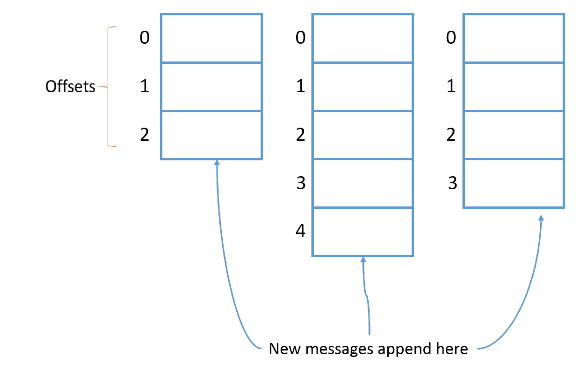

Kafka повсюду. Где есть микросервисы и распределенные вычисления, а они сейчас популярны, там почти наверняка есть и Kafka. В статье я попытаюсь объяснить, как в Kafka работает механизм хранения.

Я, конечно, постарался не усложнять, но копать будем глубоко, поэтому какое-то базовое представление о Kafka не помешает. Иначе не все будет понятно. В общем, продолжайте читать на свой страх и риск.

Обычно считается, что Kafka — это распределенная и реплицированная очередь сообщений. С технической точки зрения все верно, но термин очередь сообщений не все понимают одинаково. Я предпочитаю другое определение: **распределенный и реплицированный журнал коммитов**. Эта формулировка кажется более точной, ведь мы все прекрасно знаем, как журналы записываются на диск. Просто в этом случае на диск попадают сообщения, отправленные в Kafka.

Применительно к хранению в Kafka используется два термина: партиции и топики. Партиции — это единицы хранения сообщений, а топики — что-то вроде контейнеров, в которых эти партиции находятся.
С основной теорией мы определились, давайте перейдем к практике.
Я создам в Kafka топик с тремя партициями. Если хотите повторять за мной, вот как выглядит команда для локальной настройки Kafka в Windows.
```sh
kafka-topics.bat --create --topic freblogg --partitions 3 --replication-factor 1 --zookeeper localhost:2181
```
В каталоге журналов Kafka создано три каталога:
```sh
$ tree freblogg*
freblogg-0
|-- 00000000000000000000.index
|-- 00000000000000000000.log
|-- 00000000000000000000.timeindex
`-- leader-epoch-checkpoint
freblogg-1
|-- 00000000000000000000.index
|-- 00000000000000000000.log
|-- 00000000000000000000.timeindex
`-- leader-epoch-checkpoint
freblogg-2
|-- 00000000000000000000.index
|-- 00000000000000000000.log
|-- 00000000000000000000.timeindex
`-- leader-epoch-checkpoint
```
Мы создали в топике три партиции, и у каждой — свой каталог в файловой системе. Еще тут есть несколько файлов (index, log и т д.), но о них чуть позже.
Обратите внимание, что в Kafka топик — это логическое объединение, а партиция — фактическая единица хранения. То, что физически хранится на диске. Как устроены партиции?
**Партиции**
В теории партиция — это неизменяемая коллекция (или последовательность) сообщений. Мы можем добавлять сообщения в партицию, но не можем удалять. И под «мы» я подразумеваю продюсеров в Kafka. Продюсер не может удалять сообщения из топика.
Сейчас мы отправим в топик пару сообщений, но сначала обратите внимание на размер файлов в папках партиций.
```sh
$ ls -lh freblogg-0
total 20M
- freblogg 197121 10M Aug  5 08:26 00000000000000000000.index
- freblogg 197121   0 Aug  5 08:26 00000000000000000000.log
- freblogg 197121 10M Aug  5 08:26 00000000000000000000.timeindex
- freblogg 197121   0 Aug  5 08:26 leader-epoch-checkpoint
```
Как видите, файлы index вместе весят 20 МБ, а файл log совершенно пустой. В папках freblogg-1 и freblogg-2 то же самое.
Давайте отправим сообщения через console producer и посмотрим, что будет:
```sh
kafka-console-producer.bat --topic freblogg --broker-list localhost:9092
```
Я отправил два сообщения — сначала ввел стандартное «Hello World», а потом нажал на Enter, и это второе сообщение. Еще раз посмотрим на размеры файлов:
```sh
$ ls -lh freblogg*
freblogg-0:
total 20M
- freblogg 197121 10M Aug  5 08:26 00000000000000000000.index
- freblogg 197121   0 Aug  5 08:26 00000000000000000000.log
- freblogg 197121 10M Aug  5 08:26 00000000000000000000.timeindex
- freblogg 197121   0 Aug  5 08:26 leader-epoch-checkpoint

freblogg-1:
total 21M
- freblogg 197121 10M Aug  5 08:26 00000000000000000000.index
- freblogg 197121  68 Aug  5 10:15 00000000000000000000.log
- freblogg 197121 10M Aug  5 08:26 00000000000000000000.timeindex
- freblogg 197121  11 Aug  5 10:15 leader-epoch-checkpoint

freblogg-2:
total 21M
- freblogg 197121 10M Aug  5 08:26 00000000000000000000.index
- freblogg 197121  79 Aug  5 09:59 00000000000000000000.log
- freblogg 197121 10M Aug  5 08:26 00000000000000000000.timeindex
- freblogg 197121  11 Aug  5 09:59 leader-epoch-checkpoint
```
Два сообщения заняли две партиции, и файлы log в них теперь имеют размер. Это потому, что сообщения в партиции хранятся в файле xxxx.log. Давайте заглянем в файл log и убедимся, что сообщение и правда там.
```sh
$ cat freblogg-2/*.log
@^@^B°£æÃ^@^K^Xÿÿÿÿÿÿ^@^@^@^A"^@^@^A^VHello World^@
```
Файлы с форматом log не очень удобно читать, но мы все же видим в конце «Hello World», то есть файл обновился, когда мы отправили сообщение в топик. Второе сообщение мы отправили в другую партицию.
Обратите внимание, что первое сообщение попало в третью партицию (freblogg-2), а второе — во вторую (freblogg-1). Для первого сообщения Kafka выбирает партицию произвольно, а следующие просто распределяет по кругу (round-robin). Если мы отправим третье сообщение, Kafka запишет его во freblogg-0 и дальше будет придерживаться этого порядка. Мы можем и сами выбирать партицию, указав ключ. Kafka хранит все сообщения с одним ключом в одной и той же партиции.
Каждому новому сообщению в партиции присваивается Id на 1 больше предыдущего. Этот Id еще называют смещением (offset). У первого сообщения смещение 0, у второго — 1 и т. д., каждое следующее всегда на 1 больше предыдущего.

**<Небольшое отступление>**
Давайте используем инструмент Kafka, чтобы понять, что это за странные символы в файле log. Нам они кажутся бессмысленными, но для Kafka это метаданные каждого сообщения в очереди. Выполним команду:
```sh
kafka-run-class.bat kafka.tools.DumpLogSegments --deep-iteration --print-data-log --files logs\freblogg-2\00000000000000000000.log
```
Получим результат:
```sh
umping logs\freblogg-2\00000000000000000000.log
Starting offset: 0

offset: 0 position: 0 CreateTime: 1533443377944 isvalid: true keysize: -1 valuesize: 11 producerId: -1 headerKeys: [] payload: Hello World

offset: 1 position: 79 CreateTime: 1533462689974 isvalid: true keysize: -1 valuesize: 6 producerId: -1 headerKeys: [] payload: amazon
```
(Я удалил из выходных данных кое-что лишнее.)

Здесь мы видим смещение, время создания, размер ключа и значения, а еще само сообщение (payload).
</Небольшое отступление>

Надо понимать, что партиция привязана к брокеру. Если у нас, допустим, три брокера, а папка freblogg-0 существует в broker-1, в других брокерах ее не будет. У одного топика могут быть партиции в нескольких брокерах, но одна партиция всегда существует в одном брокере Kafka (если установлен коэффициент репликации по умолчанию 1, но об этом чуть позже).
**Сегменты**
Что это за файлы index и log в каталоге партиции? Партиция, может, и единица хранения в Kafka, но не минимальная. Каждая партиция разделена на сегменты, то есть коллекции сообщений. Kafka не хранит все сообщения партиции в одном файле (как в файле лога), а разделяет их на сегменты. Это дает несколько преимуществ. (Разделяй и властвуй, как говорится.)
Главное — это упрощает стирание данных. Я уже говорил, что сами мы не можем удалить сообщение из партиции, но Kafka может это сделать на основе политики хранения для топика. Удалить сегмент проще, чем часть файла, особенно когда продюсер отправляет в него данные.
```sh
$ ls -lh freblogg-0
total 20M
- freblogg 197121 10M Aug  5 08:26 00000000000000000000.index
- freblogg 197121   0 Aug  5 08:26 00000000000000000000.log
- freblogg 197121 10M Aug  5 08:26 00000000000000000000.timeindex
- freblogg 197121   0 Aug  5 08:26 leader-epoch-checkpoint
```sh
Нули (00000000000000000000) в файлах log и index в каждой папке партиции — это имя сегмента. У файла сегмента есть файлы segment.log, segment.index и segment.timeindex.

Kafka всегда записывает сообщения в файлы сегментов в рамках партиции, причем у нас всегда есть активный сегмент для записи. Когда Kafka достигает лимита по размеру сегмента, создается новый файл сегмента, который станет активным.
В имени каждого файла сегмента отражается смещение от первого сообщения. На картинке выше в сегменте 0 содержатся сообщения со смещением от 0 до 2, в сегменте 3 — от 3 до 5, и так далее. Последний сегмент, шестой, сейчас активен.
```sh
$ ls -lh freblogg*
freblogg-0:
total 20M
- freblogg 197121 10M Aug  5 08:26 00000000000000000000.index
- freblogg 197121   0 Aug  5 08:26 00000000000000000000.log
- freblogg 197121 10M Aug  5 08:26 00000000000000000000.timeindex
- freblogg 197121   0 Aug  5 08:26 leader-epoch-checkpoint

freblogg-1:
total 21M
- freblogg 197121 10M Aug  5 08:26 00000000000000000000.index
- freblogg 197121  68 Aug  5 10:15 00000000000000000000.log
- freblogg 197121 10M Aug  5 08:26 00000000000000000000.timeindex
- freblogg 197121  11 Aug  5 10:15 leader-epoch-checkpoint

freblogg-2:
total 21M
- freblogg 197121 10M Aug  5 08:26 00000000000000000000.index
- freblogg 197121  79 Aug  5 09:59 00000000000000000000.log
- freblogg 197121 10M Aug  5 08:26 00000000000000000000.timeindex
- freblogg 197121  11 Aug  5 09:59 leader-epoch-checkpoint
```
У нас всего по одному сегменту в каждой партиции, поэтому они называются 00000000000000000000. Раз других файлов сегментов нет, сегмент 00000000000000000000 и будет активным.
По умолчанию сегменту выдается целый гигабайт, но представим, что мы изменили параметры, и теперь в каждый сегмент помещается только три сообщения. Посмотрим, что получится.
Допустим, мы отправили в партицию freblogg-2 три сообщения, и она выглядит так:
Три сообщения — это наш лимит. На следующем сообщении Kafka автоматически закроет текущий сегмент, создаст новый, сделает его активным и сохранит новое сообщение в файле log этого сегмента. (Я не показываю предыдущие нули, чтобы было проще воспринять).
```sh
freblogg-2
|-- 00.index
|-- 00.log
|-- 00.timeindex
|-- 03.index
|-- 03.log
|-- 03.timeindex
`--
```
Удивительное дело, но новый сегмент называется не 01. Мы видим 03.index, 03.log. Почему так?
Kafka называет сегмент по имени минимального смещения в нем. Новое сообщение в партиции имеет смещение 3, поэтому Kafka так и называет новый сегмент. Раз у нас есть сегменты 00 и 03, мы можем быть уверены, что сообщения со смещениями 0, 1 и 2 и правда находятся в сегменте 00. Новые сообщения в партиции freblogg-2 со смещениями 3 ,4 и 5 будут храниться в сегменте 03.
В Kafka мы часто читаем сообщения по определенному смещению. Искать смещение в файле log затратно, особенно если файл разрастается до неприличных размеров (по умолчанию это 1 ГБ). Для этого нам и нужен файл .index. В файле index хранятся смещения и физическое расположение сообщения в файле log.
Файл index для файла log, который я приводил в кратком отступлении, будет выглядеть как-то так:
Если нужно прочитать сообщение со смещением 1, мы ищем его в файле index и видим, что его положение — 79. Переходим к положению 79 в файле log и читаем. Это довольно эффективный способ — мы быстро находим нужное смещение в уже отсортированном файле index с помощью бинарного поиска.
**Параллелизм в партициях**
Чтобы гарантировать порядок чтения сообщений из партиции, Kafka дает доступ к партиции только одному консюмеру (из группы консюмеров). Если партиция получает сообщения a, f и k, консюмер читает их в том же порядке: a, f и k. Это важно, ведь порядок потребления сообщений на уровне топика не гарантирован, если у вас несколько партиций.
Если консюмеров будет больше, параллелизм не увеличится. Нужно больше партиций. Чтобы два консюмера параллельно считывали данные из топика, нужно создать две партиции — по одной на каждого. Партиции в одном топике могут находиться в разных брокерах, поэтому два консюмера топика могут считывать данные из двух разных брокеров.
**Топики**
Наконец, переходим к топикам. Мы уже кое-что знаем о них. Главное, что нужно знать: топик — это просто логическое объединение нескольких партиций.
Топик может быть распределен по нескольким брокерам через партиции, но каждая партиция находится только в одном брокере. У каждого топика есть уникальное имя, от которого зависят имена партиций.
**Репликация**
Как работает репликация? Создавая топик в Kafka, мы указываем для него коэффициент репликации — replication-factor. Допустим, у нас два брокера и мы устанавливаем replication-factor 2. Теперь Kafka попытается всегда создавать бэкап, или реплику, для каждой партиции в топике. Kafka распределяет партиции примерно так же, как HDFS распределяет блоки данных по нодам.
Допустим, для топика freblogg мы установили коэффициент репликации 2. Мы получим примерно такое распределение партиций:
Даже если реплицированная партиция находится в другом брокере, Kafka не разрешает ее читать, потому что в каждом наборе партиций есть LEADER, то есть лидер, и FOLLOWERS — ведомые, которые остаются в резерве. Ведомые периодически синхронизируются с лидером и ждут своего звездного часа. Когда лидер выйдет из строя, один из in-sync ведомых будет выбран новым лидером, и вы будете получать данные из этой партиции.
Лидер и ведомый одной партиции всегда находятся в разных брокерах. Думаю, не нужно объяснять, почему.
Мы подошли к концу этой длинной статьи. Если вы добрались до этого места — поздравляю. Теперь вы знаете почти все о хранении данных в Kafka. Давайте повторим, чтобы ничего не забыть.
**Итоги**
 - В Kafka данные хранятся в топиках.
 - Топики разделены на партиции.
 - Каждая партиция разделена на сегменты.
 - У каждого сегмента есть файл log, где хранится само сообщение, и файл index, где хранится позиция сообщения в файле log.
 - У одного топика могут быть партиции в разных брокерах, но сама партиция всегда привязана к одному брокеру.
 - Реплицированные партиции существуют пассивно. Вы обращаетесь к ним, только если сломался лидер.
