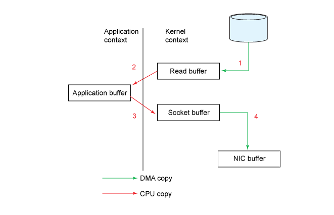
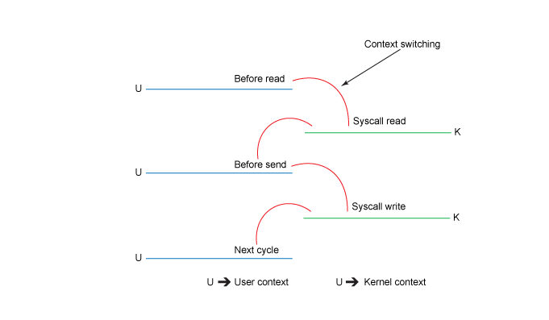
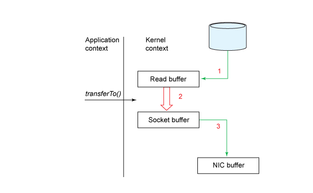
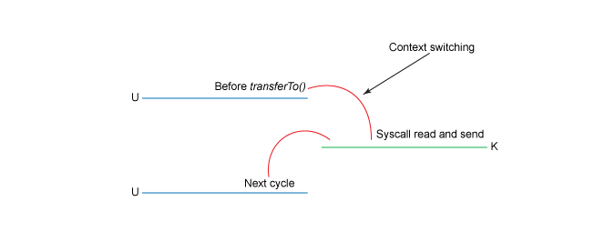
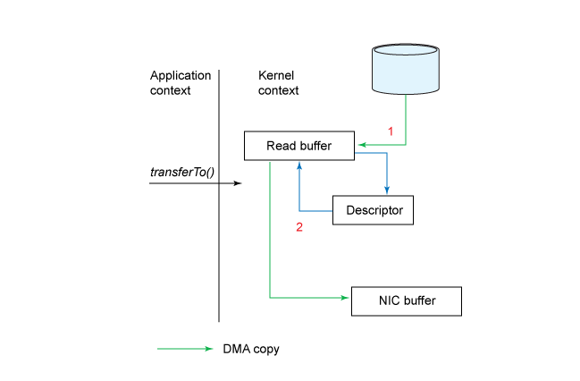

# Why kafka is so fast
Давайте начнем с того, что признаем понятие «быстрый» многогранным, сложным и крайне неоднозначным. На каждую частную интерпретацию этого слова влияют такие показатели как latency, пропускная способность (throughput) и кратковременные задержки (jitter). Слово «быстрый» также по сути контекстно: индустрия и области применения сами устанавливают нормы и ожидания по производительности.

Apache Kafka заточена под пропускную способность, которая обеспечивается за счет того, что мы жертвуем latency и jitter при сохранении остальных нужных характеристик, таких как надежность, строгий порядок записи и принцип «at least once delivery». Когда кто-то — при условии, что это хоть сколь-нибудь сведущий человек — говорит, что Kafka быстра, можно предположить, что он имеет в виду способность Kafka безопасно накапливать и передавать очень большое количество записей за короткое время.

Если обратиться к истории, Kafka появилась из необходимости LinkedIn эффективно перемещать огромные количества сообщений — до нескольких терабайт в час. Latency передачи одного сообщения приписывалось второстепенное значение, также как варьируемости времени задержки. LinkedIn, в конце концов, не финансовый институт, занимающийся высокочастотным трейдингом, и не система промышленного контроля, которая работает в пределах установленных сроков. Kafka может использоваться для внедрения близких к реальному времени систем (near real-time systems), также известных как soft real-time systems.

>Пояснение: Для тех, кому не знаком термин «реальное время», он означает не «быстро», а «предсказуемо». В частности, режим реального времени подразумевает наличие жесткой верхней границы, называемой также крайним сроком (deadline), которая определяет время, необходимое для выполнения действия. Если система как целое всякий раз не может соблюсти этих сроков, ее нельзя отнести к системам реального времени. Системы, которые могут работать в пределах вероятного отклонения, называются «близкими к реальному времени». Если перевести это на язык пропускной способности, системы реального времени зачастую оказываются медленнее, чем их аналоги, близкие к реальному времени или не относящиеся к реальному времени.

Есть две важные области, из которых Kafka черпает свою скорость, и их надо рассматривать отдельно. Первая связана с низкоуровневой реализацией клиента и брокера. Вторая проистекает из параллелизма потоковой обработки.

## Работа брокера
### Хранение данных в виде логов

Kafka использует сегментированный журнал, предназначенный только для добавления записей, в значительной степени ограничиваясь последовательным I/O и для чтения, и для операций записи, что работает быстро на самых разнообразных накопителях. Существует широко распространенное заблуждение, что диски работают медленно; однако производительность накопителей информации (особенно жестких дисков) сильно зависит от типов доступа. Производительность случайного I/O на распространенном диске SATA 7200 об/мин на три-четыре порядка ниже по сравнению с последовательным I/O. Более того, современная операционная система предусматривает методы read-ahead (упреждающего чтения) и write-behind (обратной записи), которые предварительно выбирают данные в виде кратных больших блоков и группируют меньшие логические записи в большие физические записи. Из-за этого разница между последовательным I/O и случайным I/O продолжает быть заметной во флэш-памяти и других формах твердотельных энергонезависимых носителей, хотя она гораздо менее значительна по сравнению с жесткими дисками.

### Батчинг записей

Последовательный I/O невероятно быстр на большинстве носителей и соизмерим с пиковой производительностью сетевого I/O. На практике это означает, что хорошо спроектированный слой хранения логов на диске будет успевать за сетевым трафиком. Фактически часто узким местом (bottleneck) Kafka становится не диск, а сеть. Поэтому в дополнение к низкоуровневому батчингу, предоставляемому ОС, клиенты и брокеры Kafka собирают в батч многочисленные записи (и чтение, и операции записи) перед отправкой их по сети. Пакетная обработка записей амортизирует издержки на передачу данных в обе стороны, используя более крупные батчи и повышая пропускную способность.

### Пакетное сжатие

Влияние пакетирования становится особенно очевидным, когда задействовано сжатие, поскольку сжатие становится более эффективным с увеличением объемов данных. Эффект сжатия может быть достаточно выраженным, особенно если используются текстовые форматы, как JSON, тогда коэффициент сжатия обычно варьируется от 5х до 7х. Более того, пакетная обработка записей по большей части производится как операция на стороне клиента (client-side operation), что передает нагрузку на клиента и оказывает позитивное влияние не только на пропускную способность сети, но и на использование дискового I/O брокера.

### Дешевые консюмеры

В отличие от традиционных MQ, которые удаляют сообщения после их прочтения (что приводит к штрафам за случайный I/O), Kafka не удаляет сообщения после прочтения. Вместо этого она независимо отслеживает смещения (offsets) на уровне каждой группы консюмеров (consumer group). Продвижение самих смещений публикуется во внутреннем топике Kafka __consumer_offsets. Это быстро для append-only операции (только добавление). Далее содержание этого топика сжимается в фоновом режиме (с использованием инструмента compaction Kafka), чтобы сохранить последние известные смещения для любой группы консюмеров.

Сравните эту модель с более традиционными брокерами сообщений, которые обычно предлагают несколько противоположных топологий распространения сообщений. С одной стороны, это очередь сообщений — надежный транспорт для отправки сообщений point-to-point, без возможности отправки point-to-multipoint. С другой стороны, топик pub-sub позволяет отправку сообщений point-to-multipoint, но делает это за счет надежности. Внедрение надежной модели отправки сообщений point-to-multipoint в традиционной MQ-модели требует поддержания выделенной очереди сообщений для каждого консюмера с отслеживанием состояния. Это создает повышенную нагрузку при read/write amplification. С одной стороны, publisher вынужден писать в много очередей. В качестве альтернативы применяется отправка или fan-out, которая может потреблять записи из одной очереди и записывать их в несколько других, но это только задерживает amplification. С другой стороны, несколько консюмеров создают нагрузку на брокера, представляя собой смесь операций I/O для чтения и записи, как последовательных, так и случайных.

Консюмеры в Kafka «дешевы», поскольку они не изменяют файлы журнала (это разрешено только продюсерам или внутренним процессам Kafka). Это означает, что много консюмеров могут одновременно читать из одного и того же топика, не перегружая кластер. Добавление консюмера все еще требует некоторых затрат, но в основном это последовательное чтение с низкой скоростью последовательных операций записи. Поэтому вполне нормально видеть, что один топик используется сразу несколькими консюмерами.

### Неизмененные буферизованные операции записи

Еще одна фундаментальная причина производительности Kafka, которую стоит подробнее исследовать: Kafka фактически не вызывает fsync при записи на диск перед подтверждением операции записи. Единственное требование для ACK (подтверждения), чтобы запись была сделана в I/O-буфер. Это малоизвестный, но важный факт. Именно это позволяет Kafka работать так, как если бы это была очередь в памяти. Поскольку по всем параметрам Kafka — это очередь в памяти с дисковым бэкапом (disc-backed in-memory queue), ограниченная размером буфера/кэша страниц.

В то же время эта форма операций записи небезопасна, поскольку сбой реплики может привести к потере данных, даже несмотря на то что запись, казалось бы, была подтверждена. Другими словами, в отличие от, скажем, реляционной базы данных, подтверждение записи само по себе не означает надежности. Надежность Kafka обеспечивается запуском нескольких синхронизированных реплик. Даже если одна даст сбой, другие (при условии, что их больше одной) продолжат работать — при условии, что сбой не коррелирован (то есть несколько реплик не дают сбой одновременно из-за общего сбоя на директивном уровне). Таким образом, сочетание неблокирующего подхода к I/O без использования fsync, плюс дублирующие синхронизируемые реплики приводит Kafka к сочетанию высокой пропускной способности, надежности и доступности.

### Оптимизация на стороне клиента

Большинство баз данных, очередей и других хранилищ созданы вокруг понятия всемогущего сервера (или кластера серверов) и довольно небольших клиентов, которые взаимодействуют с сервером(ами) по хорошо известному протоколу. Распространено мнение, что клиентские реализации гораздо проще серверных. В результате сервер берет на себя основную нагрузку, а клиенты выступают лишь как интерфейсы между кодом приложения и сервером.

Kafka использует другой подход к дизайну клиента. Прежде чем записи попадут на сервер, значительное количество работы производится на клиенте. Сюда относится аккумулирование записей, хеширование ключей записи, чтобы они оказались в правильной партиции, проверка checksum записей и сжатие батча записей. Клиент знает о метаданных кластера и периодически обновляет эти метаданные, чтобы не отставать от изменений в топологии брокера. Это позволяет клиенту принимать решения о пересылке на нижнем уровне. Вместо того чтобы слепо пересылать запись в кластер и полагаться на то, что последний перешлет их на соответствующий брокерский узел, клиент пересылает записи непосредственно мастерам партиций. Похожим образом клиенты консюмеры могут принимать разумные решения, когда ищут источники записей, потенциально используя реплики, которые географически ближе к клиенту при выдаче запросов на чтение. (Эта функция была добавлена в Kafka позднее и доступна с версии 2.4.0.)

### Zero-copy

Один из обычных источников неэффективности — копирование байтовых данных между буферами. Kafka использует бинарный формат сообщений, который является общим для продюсера, брокера и консюмера, поэтому фрагменты данных могут передаваться напрямую без изменений, даже если они подверглись сжатию. Хотя устранение структурных различий между общающимися сторонами является важным шагом, само по себе оно не избегает копирования данных.

Kafka решает эту проблему на Linux и UNIX при помощи Java’s NIO, в частности метод transferTo() класса java.nio.channels.FileChannel. Этот метод позволяет передавать байты из исходного канала в канал-приемник без привлечения приложения как посредника передачи. Чтобы оценить перемены, привнесенные NIO, рассмотрим традиционный подход, в котором исходный канал считывается в байтовый буфер и затем записывается в канал-приемник как две отдельные операции:
```sh
File.read(fileDesc, buf, len);
Socket.send(socket, buf, len);
```
Графически это можно представить следующим образом:


Хотя это выглядит достаточно просто, внутренне операция копирования требует четырех переключений контекстов между пользовательским режимом и режимом ядра, и данные копируются четыре раза до завершения операции. Представленная ниже диаграмма показывает контекстные переключения на каждом этапе.


Если посмотреть на это более подробно:
 - Начальный read() вызывает переключение контекста из пользовательского режима в режим ядра. Файл прочитан, а его содержимое копируется в буфер в адресном пространстве ядра при помощи механизма DMA (Direct Memory Access, прямой доступ к памяти). Это не тот же самый буфер, который использовался во фрагменте кода.
 - Перед возвратом из read() буфер ядра копируется в буфер пользовательского пространства. Здесь наше приложение может прочитать содержимое файла.
 - Последующий send()переключится обратно в режим ядра, скопировав буфер пользовательского пространства в адресное пространство ядра — на этот раз в другой буфер, связанный с сокетом назначения. За кулисами за дело берется механизм DMA, асинхронно копируя данные из буфера ядра в стек протокола. Метод send() ждет этого после возврата.
 - Метод/вызов send() возвращается, переключаясь обратно в контекст пользовательского пространства.

Несмотря на недостатки переключения контекстов и дополнительное копирование, промежуточный буфер ядра во многих случаях может улучшить производительность. Он может выступать в качестве кеша упреждающего чтения, асинхронно выбирая блоки, тем самым с опережением выполняя запросы приложений. Однако когда количество запрашиваемых данных значительно превышает объем буфера ядра, буфер ядра становится узким местом производительности системы. Вместо того чтобы напрямую копировать данные, он вынуждает систему переключаться между режимами пользователя и ядра на всем процессе передачи данных.

Для сравнения, подход с zero-copy обрабатывается за одну операцию. Фрагмент из предыдущего примера можно переписать в одну строчку:
```sh
fileDesc.transferTo(offset, len, socket);
```
Подход с zero-copy проиллюстрирован на схеме ниже:


В этой модели количество переключений контекста снижено до одного. Если конкретно, то метод transferTo() указывает блочному устройству считывать данные в буфер чтения при помощи механизма DMA. Этот буфер затем копируется в другой буфер ядра для подготовки к записи в сокет. Наконец, буфер сокета копируется в буфер NIC с помощью DMA.


В результате мы снизили число копирований с четырех до трех, и только одно копирование использует CPU. Мы также сократили количество переключений контекста с четырех до двух.

Это большое улучшение, но это еще не zero-copy. Последнее может быть достигнуто в виде дальнейшей оптимизации при работе с ядром Linux версии 2.4 и выше, а также на сетевых картах, которые поддерживают операцию gather. Иллюстрация ниже.


Вызов метода transferTo() заставляет устройство считывать данные в буфер ядра при помощи механизма DMA, как в предыдущем примере. Однако при операции gather отсутствует копирование между буфером чтения и буфером сокета. Вместо этого NIC получает указатель на буфер чтения вместе со смещением и длиной. Буфер чтения очищается DMA. Ни в один момент CPU не вовлечен в копирование буферов.

Сравнение традиционного подхода и подхода с zero-copy на файлах различного размера от нескольких мегабайт до гигабайта показывают двух- или трехкратный рост производительности в пользу zero-copy. Но еще более впечатляет то, что Kafka добивается этого, используя простой JMV без собственных библиотек или JNI кода.

### Избегание сборки мусора

Активное использование каналов, собственных буферов и кэша страниц рождает еще одно дополнительное преимущество — снижение нагрузки на сбор мусора (GC). Например, запуск Kafka на машине с 32 Гб RAM приведет к тому, что 28-32 Гб будут использоваться как кэш страниц, полностью выходя за пределы диапазона действия GC. Разница в пропускной способности минимальна (в районе нескольких десятых процента), поскольку пропускная способность правильно настроенного GC может быть достаточно высокой, особенно когда он работает с краткосрочными объектами. Реальные успехи лежат в сфере снижения джиттера. Избегая GC, брокеры с меньшей вероятностью испытают паузу, которая сможет повлиять на клиента, увеличив задержку сквозной доставки записей.

Справедливости ради стоит заметить, что избегание GC стало сейчас меньшей проблемой по сравнению с тем, когда Kafka только зарождалась. Современные GC, как Shenandoah и ZGC масштабируются до огромных многотерабайтных куч и имеют настраиваемую по длительности паузу для наихудшего случая вплоть до однозначных миллисекунд. В наши дни можно часто увидеть, как приложения на основе JVM, которые используют большие кэши на основе кучи, превосходят проекты без куч.

### Потоковый параллелизм

Эффективность журнально-структурированного I/O — один из важнейших аспектов производительности, в основном влияющий на операции записи. Для производительности чтения фундаментальными является то, как Kafka трактует параллелизм в структуре темы и экосистемы консюмеров. Их комбинация создает очень высокую общую пропускную способность для сквозного обмена сообщениями. Параллельное выполнение встроено в ее схему разделения и работу групп консюмеров, что является тем самым механизмом балансировки нагрузки внутри Kafka, распределяя задания разделения примерно равным образом между отдельными экземплярами консюмеров в группе. Сравните это с более традиционным MQ: в эквивалентной настройке RabbitMQ множественные одновременные консюмеры могут читать из очереди, построенной по циклическому алгоритму, но при этом они теряют понятие упорядочивания сообщений.

Механизм разделения также позволяет горизонтально масштабировать брокеров Kafka. У каждого раздела есть отдельный лидер; поэтому каждый нетривиальный топик (со множеством разделов) может использовать весь кластер брокера для операций записи. И это еще одно различие между Kafka и очередью сообщений. Тогда как последняя использует кластеризацию для обеспечения доступности, Kafka действительно распределяет нагрузку между брокерами ради поддержания доступности, надежности и пропускной способности.

При публикации записи продюсер определяет раздел, мы предполагаем сейчас, что вы публикуете в топик с несколькими разделами. (Если у кого-то топик с одним разделом, то такой проблемы нет). Это можно сделать либо напрямую, указав индекс раздела, либо опосредованно — с помощью ключа записи, который детерминированно хеширует в постоянный (то есть один и тот же каждый раз) индекс раздела. Записи, имеющие один и тот же хеш, гарантированно займут один и тот же раздел. Предположим, что в теме несколько разделов, тогда записи с другим ключом, скорее всего, окажутся в других разделах. Однако из-за коллизий хеш-функций записи с разными хешами могут также оказаться в одном разделе. Такова природа хеширования. Если вы понимаете, как работает хеш-таблица, то здесь все то же самое.

Фактическая обработка записей производится консюмерами, работающими в рамках (опциональной) группы консюмеров. Kafka гарантирует, что раздел может быть закреплен максимально за одним консюмером в его группе консюмеров. (Мы говорим «максимум», предусматривая случай, когда все консюмеры находятся оффлайн). Когда первый консюмер в группе подписывается на топик, он получает все разделы по этом топике. Когда позднее на этот топик подписывается второй консюмер, он получит примерно половину разделов, освобождая первого консюмера от половины его предыдущей нагрузки. Это позволяет обрабатывать поток событий параллельно, при необходимости добавляя консюмеров (в идеале используя механизм автоматического масштабирования), при условии что вы правильно разбили поток событий.

Контроль пропускной способности записи осуществляется двумя способами:
 - **Схема разбиения топика.** Топики должны быть разделены, чтобы максимизировать количество независимых суб-потоков событий. Другими словами, порядок записи следует сохранять только там, где это абсолютно необходимо. Если любые две записи не связаны обоснованно в причинно-следственном смысле, они не должны быть привязаны к одному и тому же разделу. Это подразумевает использование разных ключей, так как Kafka использует ключ записи в качестве источника хеширования, чтобы получить согласованную карту разделов.
 - **Количество консюмеров в группе.** Вы можете увеличить количество консюмеров так, чтобы оно соответствовало нагрузке от входящих сообщений, вплоть до количества разделов в топике. (Можно иметь и больше консюмеров, если хотите, но счетчик разделов в таком случае ограничит количество активных консюмеров, которые получат минимум один назначенный раздел; оставшиеся консюмеры будут находиться в режиме ожидания). Обратите внимание, что консюмером может быть процесс или поток. В зависимости от типа рабочей нагрузки, которую выполняет консюмер, вы можете использовать несколько потоков из отдельных консюмеров или записи процессов в пуле потоков.

Если вы задавались вопросом, быстра ли Kafka, как она достигает своих знаменитых характеристик производительности, может ли она масштабироваться к вашим практическим кейсам, вы должны были, надеюсь, уже получить все ответы, которые вам были нужны.

Чтобы окончательно все прояснить, Kafka не самое быстрое (если смотреть на скорость с точки зрения пропускной способности) межплатформенное ПО для обмена сообщениями: есть другие платформы, с бОльшими пропускными способностями, — какие-то программные, другие реализованы на железе. И также она не предлагает лучший компромисс между пропускной способностью и latency. Например, Apache Pulsar — многообещающая технология, которая может масштабироваться и достигает лучшего профиля пропускной способности и latency, в то же время предлагая идентичный Kafka порядок и гарантии надежности. Основная причина для выбора именно Kafka это то, что как целостная экосистема она в общем-то по прежнему не знает себе равных. Она показывает отличную производительность, в то же время предлагая среду, которая одновременно устойчивая, сложившаяся и углубляющаяся: несмотря на свои размеры Kafka продолжает расти завидными темпами.

Разработчики и специалисты по сопровождению Kafka проделали потрясающую работу по разработке ориентированного на производительность решения. Лишь малая часть ее конструктивных элементов ощущаются придуманными задним числом или ситуативными. Начиная от переноса работы на клиентов и до лог-структурированного хранилища на брокере, пакетирования, сжатия, zero-copy I/O и потокового параллелизма Kafka бросает вызов практически любому ориентированному на сообщения межплатформенному ПО, коммерческому или с открытым исходным кодом. Еще больше впечатляет то, что она делает это без ущерба для надежности, порядка записи и модели «at least once delivery».

Kafka не самая простая платформа для обмена сообщениями, в ней есть, что поизучать. Прежде чем уверенно разрабатывать и строить высокопроизводительные, управляемые событиями системы, стоит разобраться с понятиями полного и частичного порядка, тем, разделов, консюмеров и групп консюмеров. Объем материала очень велик, но результат, безусловно, стоит затраченных вами усилий.

